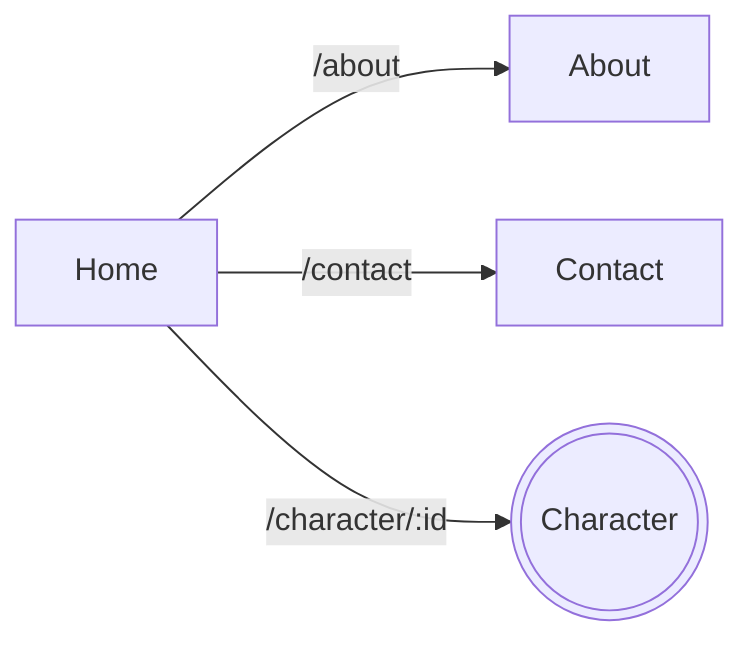

[](https://github.com/LeoCdrt/Marvel-app)

[](https://sonarcloud.io/summary/new_code?id=LeoCdrt_Marvel-app)
[](https://sonarcloud.io/summary/new_code?id=LeoCdrt_Marvel-app)

# Marvel App

## Installation

git clone url-du-projet
cd marvel-app

npm install

```bash
git clone https://github.com/LeoCdrt/Marvel-app
cd Marvel-app
npm install
```
## Lancement
```bash
npm start
```
L'application est accessible à l'adresse http://localhost:3000

## Test
Execution des tests unitaires en mode watch, c'est à dire que les tests sont relancés à chaque modification de code.
```bash
npm test
```
Execution des tests uniquement une fois avec un rapport détaillé de la couverture du code
```bash
npm run test:coverage
```
## Conception 
Le projet est décomposé en 4 étapes :
* Home (page d'acceuil): Liste des personnages
* Character : Page de détail d'un personnage 
* About : Page dinformation sur l'application 
* Contact : Page de contact 



